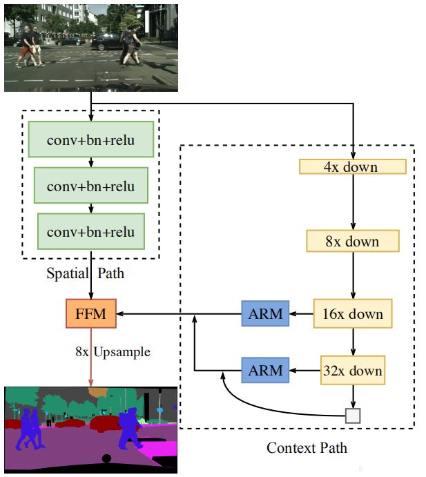

# BiSeNet
## 网络结构

# Spatial Path（空间路径）

包含三个卷积+bn+relu, 输入大尺寸图片，输出为原图像的1/8
用于提取空间信息

# Context Path（传统神经网络+注意力模块ARM）

论文原文采用Xception作为backbone可选用其他网络替代
使用全局均值化降低运算量，稳定最大感受野

# 注意力优化模块（ARM）

借助全局平均池化捕获全局语境，计算注意力向量，优化 Context Path 中每一阶段的输出特征，便于整合全局语境信息，大大降低计算成本。

# 特征融合模块（FFM）
Spatial Path 捕获的空间信息编码了绝大多数的丰富细节信息，Context Path 的输出特征主要编码语境信息。
两路网络的特征并不相同，因此不能简单地加权两种特征，要用一个独特的特征融合模块以融合这些特征。
简而言之，两个路径的特征图直接叠加不合适，那就设定个卷积网络，去训练学习一下两部分如何叠加。

# 上采样

原文介绍不需要上采样，直接使用双线性差值进行8倍放大，好处是减少参数
因为作者进行实验，发现Decoder对结果影响不大，所以选择降低计算量

# Loss Function

通过辅助损失函数监督模型的训练，
主损失函数监督整个 BiSeNet 的输出(Lp)。
添加两个特殊的辅助损失函数监督 Context Path 的输出(Li)
借助参数 α 以平衡主损失函数与辅助损失函数的权重。

上图中，K=3，α=1，即对Context Path的监督引入了两个辅助损失函数。
主损失函数和辅助损失函数都使用Softmax ，公式如下。

