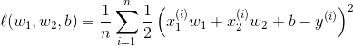
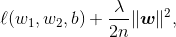
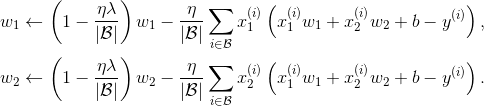

# BatchNorm(批规范化)
## 目的
深度学习的话尤其是在CV上都需要对数据做归一化，因为深度神经网络主要就是为了学习训练数据的分布，
并在测试集上达到很好的泛化效果，但是，如果我们每一个batch输入的数据都具有不同的分布，显然会
给网络的训练带来困难。另一方面，数据经过一层层网络计算后，其数据分布也在发生着变化，此现象称
为Internal Covariate Shift，会给下一层的网络学习带来困难。

## Internal Covariate Shift
此术语是google小组在论文Batch Normalizatoin 中提出来的，其主要描述的是：训练深度网络的时
候经常发生训练困难的问题，因为，每一次参数迭代更新后，上一层网络的输出数据经过这一层网络计算后
，数据的分布会发生变化，为下一层网络的学习带来困难（神经网络本来就是要学习数据的分布，要是分布
一直在变，学习就很难了），此现象称之为Internal Covariate Shift。

## 对比旧的方法
之前的解决方案就是使用较小的学习率，和小心的初始化参数，对数据做白化处理，但是显然治标不治本。

## Internal Covariate Shift 和 Covariate Shift
Internal Covariate Shift 和Covariate Shift具有相似性，但并不是一个东西，前者发生在神
经网络的内部，所以是Internal，后者发生在输入数据上。

## BN解决方案
为了减小Internal Covariate Shift，对神经网络的每一层做归一化不就可以了

## 常用地方
每个网络层之后，对每个batch做归一化处理

# 权重衰减和L2正则
## 概念
权重衰减等价于L2 范数正则化（regularization）。正则化通过为模型损失函数添加惩罚项使得
学出的模型参数值较小，是应对过拟合的常⽤⼿段。我们先描述L2 范数正则化，再解释它为何
⼜称权重衰减。
L2 范数正则化在模型原损失函数基础上添加L2 范数惩罚项，从而得到训练所需要最小化的函
数。L2 范数惩罚项指的是模型权重参数每个元素的平⽅和与⼀个正的常数的乘积。损失函数如下:

w1与w2是权重参数，b是偏置参数，样本i 的输⼊为x(i),标签为y(i)，样本数为n
将权重参数⽤向量w = [w1;w2]表示，带有L2 范数惩罚项的新损失函数为

其中超参数 > 0。当权重参数均为0 时，惩罚项最小。当 较⼤时，惩罚项在损失函数中的⽐
重较⼤，这通常会使学到的权重参数的元素较接近0。当 设为0 时，惩罚项完全不起作⽤。上
式中L2 范数平⽅∥w∥2 展开后得到w2。有了L2 范数惩罚项后，在小批量随机梯度下降中。

权重w1 和w2 的迭代⽅式更改为:

L2 范数正则化令权重w1 和w2 先⾃乘小于1 的数，再减去不含惩罚项的梯度。因此，L2
范数正则化⼜叫权重衰减。权重衰减通过惩罚绝对值较⼤的模型参数为需要学习的模型增加了限
制，这可能对过拟合有效。实际场景中，我们有时也在惩罚项中添加偏差元素的平⽅和。

### 作用
避免过拟合