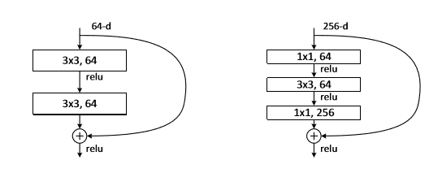

# 汇总
## bottleneck - 瓶颈层
瓶颈层结构, 一头大一头小所以叫做瓶颈层

# 作用

网络输入H x W x C

特征图输出通道(channel)太多，给channel降纬

## 出现情况

在ResNet深层次网络层出现，下图左侧出现在ResNet-34（without-bottleneck），下图右侧出现在ResNet-50/101/152（with-bottleneck），H(x) = F(x) + x

左图没有使用瓶颈层，右图使用了瓶颈层

