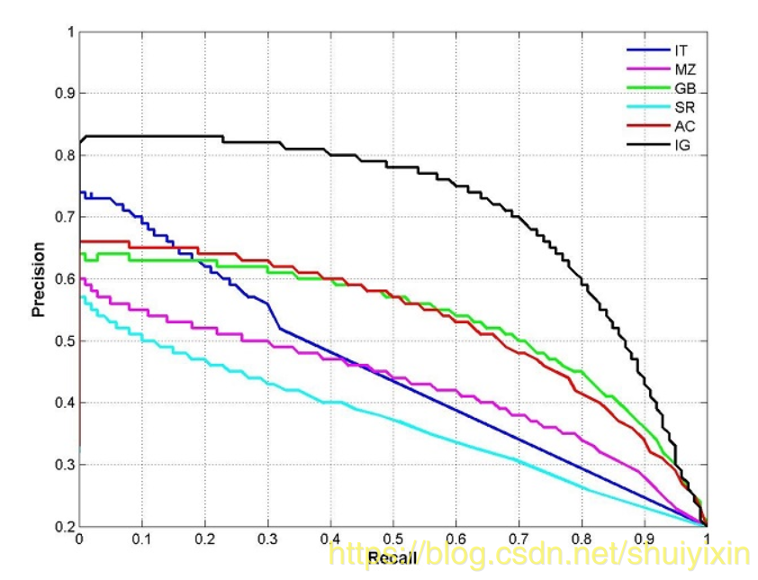

# mAP
# 正例和负例
现在假设我们的分类目标只有两类，计为正例（positive）和负例（negtive），然后我们就能得到如下的四种情况：

- True positives(TP):  被正确地划分为正例的个数，即实际为正例且被分类器划分为正例的实例数（样本数）

- False positives(FP): 被错误地划分为正例的个数，即实际为负例但被分类器划分为正例的实例数

- False negatives(FN):被错误地划分为负例的个数，即实际为正例但被分类器划分为负例的实例数

- True negatives(TN): 被正确地划分为负例的个数，即实际为负例且被分类器划分为负例的实例数

# P(精确率)
P 代表 precision，即精确率，精确率表示预测样本中实际正样本数占所有正样本数的比例，计算公式为：

精确率 = 正确预测样本中实际正样本数 / 所有的正样本数

即 precision = TP/（TP+FP）

# R(召回率)
R 代表 recall ，即召回率，召回率表示预测样本中实际正样本数占所有预测的样本的比例，计算公式为：  

召回率 = 正确预测样本中实际正样本数 /实际的正样本数

即 Recall = TP/(TP+FN)

一般来说，召回率越高，准确率越低

# ACC(准确率)
ACC 代表 Accuracy，即准确率，准确率表示预测样本中预测正确数占所有样本数的比例，计算公式为：

准确率 = 预测样本中所有被正确分类的样本数 / 所有的样本数

即 ACC = （TP+TN）/（TP+FP+TN+FN）

# AP(平均精确度)
AP 代表  Average Precision，即平均精确度

# mAP
mAP 是 Mean Average Precision  的缩写，即 均值平均精度。作为 object dection 中衡量检测精度的指标。计算公式为：

mAP = 所有类别的平均精度求和除以所有类别

# P—R曲线
P-R曲线，就是P-R的关系曲线图，表示了召回率和准确率之间的关系；我们可以在坐标系上做以 precision 和 recall 作为 纵、横轴坐标 的二维曲线

上图就是一个P-R曲线的例子，通过这几个例子，我们能够发现一个规律：精度越高，召回率越低，当召回达到1时，对应概率分数最低的正样本，这个时候正样本数量除以所有大于等于该阈值的样本数量就是最低的精度值